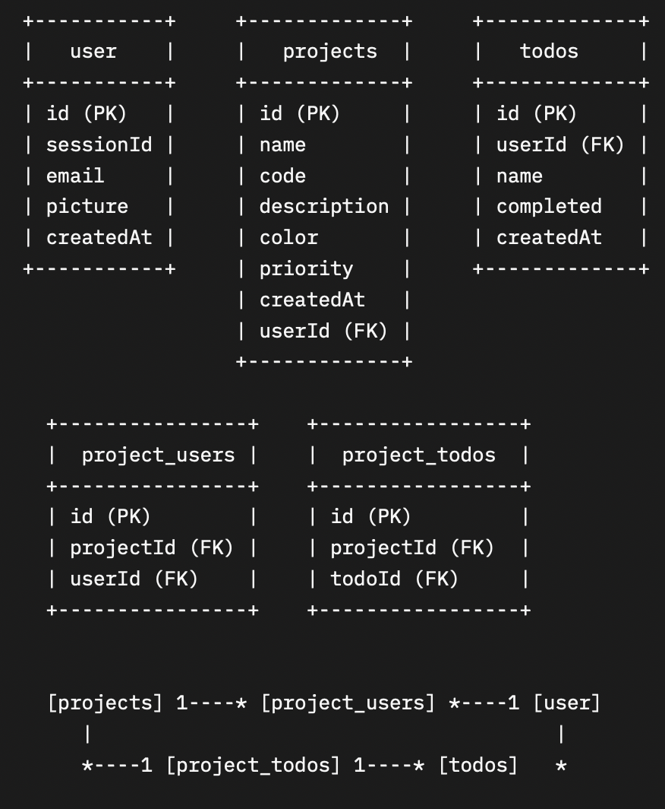

# 🔖 アプリケーションの概要

## **Goaal** - タスク管理および共同作業ツール

>Goaal は、「タスク管理および共同作業ツール」を提供しています。このアプリケーションは、目標達成に必要なタスク管理を支援するためのツールで、大きな作業を細かく分割して実現可能性を高めます。チームメンバー間の協力と作業進捗を一目で確認できるため、作業の効率を向上させることができるサービスです。

> 下記のリンクを参照してください。🙇‍♂️    
- **URl** : https://salty-hamlet-77528.herokuapp.com/

# ✨アプリケーションの機能一覧

## 機能
1. **タスクの追加と管理**
   - ウェブサイトを通じてタスクを新しく追加し、リストを作成して管理することができます。

2. **タスクの詳細情報の確認**
   - ウェブサイト上で各タスクの詳細情報を確認することができるため、いつどのタスクを行うべきかを把握することができます。

3. **タスクに参加する人の確認**
   - 各タスクに参加する人のリストを確認することで、どの人がそのタスクを実行しているかを把握することができます。

4. **タスクの進捗状況の確認**
   - タスクの進捗状況を確認して、どの程度完了しているかを把握することができます。

5. **タスクの編集および削除**
   - 各タスクの情報を編集または削除することができます。

6. **Google OAuthを利用したログイン**
   - Googleアカウントでログインし、より安全で簡単なログインが可能です。
---
## CRUD
**Create**

|   | Function | 説明 |
|---|----------|------|
| ⨁ | タスク追加 | AddTask: タスクを追加します。 |
| ⨁ | Todoリスト追加 | AddTodoList: Todoリストを追加します。 |

**Read**

|   | Function | 説明 |
|---|----------|------|
| 🔍 | ユーザー情報取得 | GetUserInfo: 指定されたIDのユーザー情報を取得します。 |
| 🔍 | タスクリスト取得 | GetTaskList: タスクリストを取得します。 |
| 🔍 | タスク情報詳細取得 | GetTaskDetail: 指定されたタスクの詳細情報を取得します。 |
| 🔍 | タスク参加者リスト取得 | GetTaskParticipants: 指定されたタスクに参加しているユーザーのリストを取得します。 |
| 🔍 | タスクへ招待可能なユーザーリスト取得 | GetTaskAvailableUsers: 指定されたタスクに招待可能なユーザーのリストを取得します。 |
| 🔍 | タスク完了状態チエック | CheckTaskComplete: 指定されたタスクの完了状態を確認します。 |
| 🔍 | タスク編集権限確認 | CheckTaskEditAuth: 指定されたタスクの編集権限を持っているかどうかを確認します。 |
| 🔍 | タスク進捗状況取得 | GetTaskProgress: 指定されたタスクの進捗状況を取得します。 |

**Update**

|   | Function | 説明 |
|---|----------|------|
| 🖊️ | タスク情報更新 | UpdateTask: 指定されたタスクの情報を更新します。 |
| 🖊️ | タスク完了状態更新 | UpdateTaskComplete: 指定されたタスクの完了状態を更新します。 |

**Delete**

|   | Function | 説明 |
|---|----------|------|
| 🗑️ | タスク削除 | DeleteTask: 指定されたタスクを削除します。 |
| 🗑️ | Todoリスト削除 | DeleteTodoList: 指定されたTodoリストを削除します。 |
| 🗑️ | 完了したタスク削除 | DeleteCompletedTask: 完了したタスクを削除します。 |

**Other**

|   | Function | 説明 |
|---|----------|------|
| 🔒 | Google OAuth ログイン及びコールバックハンドラ | GoogleOAuthLoginCallback: Google OAuthのログイン及びコールバックハンドラを提供します。 |
| 🔒 | ミドルウェアを使用したログインチェック及びアクセス権限チェック | CheckAuth: リクエストに対してログインチェック及びアクセス権限チェックを行います。 |
| 📂 | 静的ファイルの提供 |  |

---

# 💻 技術一覧

- プログラミング言語 : `GO`, `JavaScript`
- その他 : `Ajax`, `Bootstrap`, `CSS`, `HTML`
- インフラ : `Heroku`
- データベース : `SQLlite`
- 開発ツール : `GitHub`

# 🔍 データベースER図

- `User`は複数の`Project`を持つことができます。
- `Project`と`User`の間には、`project_users`テーブルを通じて多対多の関係が定義されています。
- `Project`は複数の`Todo`を持つことができます。
- `Project`と`Todo`の間には、`project_todos`テーブルを通じて多対多の関係が定義されています。
- `User`は複数の`Todo`を持つことができます。

上記のようなデータベースの関係を表すために、多対多の関係を示すテーブルを使用しています。

- `project_users`テーブル：`Project`と`User`の間の多対多の関係を表します。
- `project_todos`テーブル：`Project`と`Todo`の間の多対多の関係を表します。

   

### ⬛️ 開発をする際にに工夫したところ  
- 開発作業を行う中で考えたことは、Webブラウザ上で非同期処理で処理される部分が原因で、想定とは異なる動きをしたり、予期しない現象が発生することがあるため、解決方法を確認しながら開発作業を進めました。
- また、アプリケーションの設計構造をよく考えるように心がけました。他の人でもわかりやすく、保守性の高いコードを作成するよう努めました。また、重複するコードを削除してコードの長さを短縮することを考えました。

### ⬛️ 開発作業を行う際に大変だったところ  
- 開発作業中に苦労した点は、今回使用したGo言語が初めてだったため、新しい言語の文法を学びながらプロジェクトを作成することが難しかったことです。また、普段業務でバックエンド開発を主に行っていたため、フロントエンドでデザインを希望通りに作成するために調査すること、画面の相互作用による動きの変化など、普段知らない分野だったため苦労しました。

### ⬛️ 今回の個人開発を通してよかったところ
- 今回の開発を通じて、設計からすべてゼロから進めることができたため、様々な悩みを考えることができ、他の言語、他の環境でも自分が望むように開発できるという自信を得ることができました。実際の開発作業は個人プロジェクトより複雑ですが、基本に忠実であればどこでも通用するという考え方を持つようになりました。また、必要な知識はその都度勉強して開発していける自信を得ることができました。
